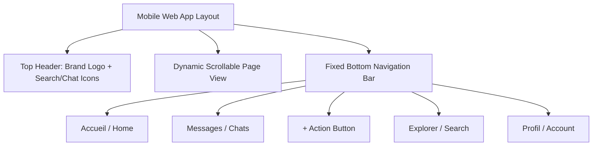
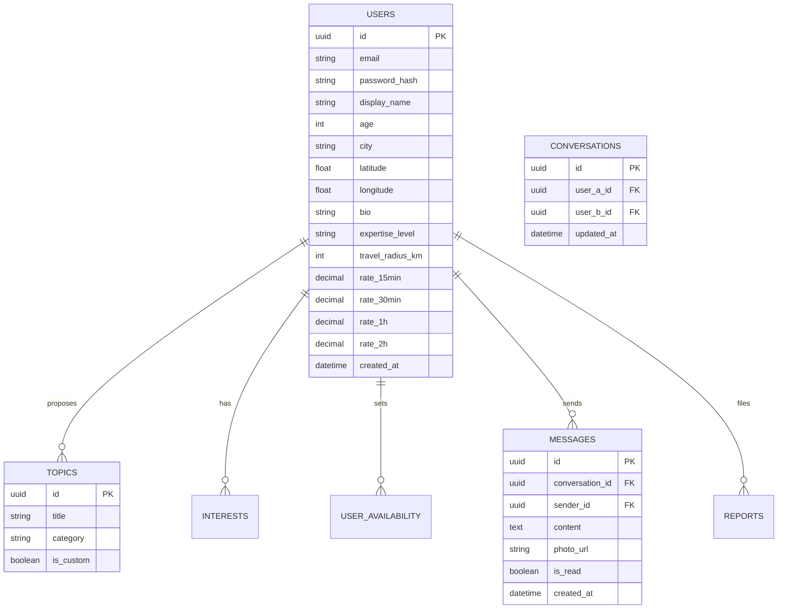

# 📄 Comprehensive Project Specification & Details Report
**Project Name:** Un Vrai Réseau Social  
**Target Platform:** Mobile Web (Smartphone Only)  
**Document Version:** 1.0 (MVP Specification)  
**Date:** August 9, 2026  

---

## 📑 Table of Contents
1. [Executive Summary](#1-executive-summary)
2. [Project Vision & Business Model](#2-project-vision--business-model)
3. [Target Platform & Technical Scope](#3-target-platform--technical-scope)
4. [MVP vs. Future Scope Matrix](#4-mvp-vs-future-scope-matrix)
5. [Detailed Feature Specifications](#5-detailed-feature-specifications)
   - [5.1 User Accounts & Authentication](#51-user-accounts--authentication)
   - [5.2 User Profile & Data Model](#52-user-profile--data-model)
   - [5.3 Search & Discovery Engine](#53-search--discovery-engine)
   - [5.4 Messaging & Real-Time Communication](#54-messaging--real-time-communication)
   - [5.5 Moderation & Administration](#55-moderation--administration)
   - [5.6 Static & Information Pages](#56-static--information-pages)
6. [Design System & UI Component Specs](#6-design-system--ui-component-specs)
7. [Proposed Technical Architecture & Data Schemas](#7-proposed-technical-architecture--data-schemas)
8. [Implementation Roadmap](#8-implementation-roadmap)

---

## 1. Executive Summary

**"Un Vrai Réseau Social"** is a mobile-first web application engineered to facilitate real-world, in-person meetings (*"des rencontres en vrai"*) centered around shared passions, interests, and intellectual topics. Unlike conventional social media platforms focused on digital-only interactions or dating apps focused primarily on romance, this platform acts as an exchange network connecting curious individuals, enthusiasts, and experts for meaningful face-to-face discussions.

The MVP focuses exclusively on **smartphone browsers**, delivering a fast, intuitive experience for browsing local profiles, searching by specific discussion topics, and coordinating meetups via private messaging.

---

## 2. Project Vision & Business Model

- **Core Goal:** Enable users to find local discussion partners on specific topics (e.g., Archaeology, Science, History, Economics, Art, Music).
- **Peer-to-Peer Model:** Users define their rate for a meeting across 4 fixed time durations (15 min, 30 min, 1 hour, 2 hours).
- **Payment Processing:** **Out of scope for platform.** Payments occur directly between users in person outside of the web application. The application does not collect transaction fees or manage payment gateways in the MVP phase.
- **Currency:** Exclusively **Euros (€)**.

---

## 3. Target Platform & Technical Scope

> [!IMPORTANT]
> **Mobile Web Only (Smartphone):** The application must be built and optimized exclusively for smartphone screens. Desktop and tablet layouts are strictly **out of scope** for MVP version 1.0.

- **Frontend:** Responsive Mobile Web Application (Target Viewport: ~375px–430px width).
- **Geolocation:** Proximity searching based on user-entered city and calculated latitude/longitude coordinates (haversine formula or simple spatial index). Exact addresses and live GPS tracks are **never** displayed to third parties for privacy reasons.

---

## 4. MVP vs. Future Scope Matrix

Based on reconciliation between the original specification ([Requirements.md](file:///e:/French%20App/Requirements.md)) and the client clarification Q&A:

| Feature Area | Original User Story / Mockup | Final MVP Scope | Notes & Rationale |
| :--- | :--- | :--- | :--- |
| **Reviews & Ratings** | 5-star ratings & written feedback | ❌ **Excluded for MVP** | Confirmed by client Q&A (Items #11, 16, 17, 18). |
| **Responsive Views** | Desktop & Tablet views | ❌ **Mobile Only** | Confirmed by client Q&A (Item #15). |
| **Location Data** | GPS tracking / street address | 🌆 **City Name Only** | Coordinates used strictly behind scenes for distance calc. |
| **Availability Selection** | Full interactive calendar picker | 📋 **Preset Multi-select Options** | Options: `Tous les jours`, `En semaine`, `Week-end`, `Matin`, `Après-midi`, `Soir`. |
| **Chat Media** | Text, photos, videos, documents | 📷 **Text + Photos Only** | Videos and documents excluded for MVP simplicity. |
| **Topic Moderation** | Admin approval needed for topics | ⚡ **Instant Auto-Approval** | Users can add topics dynamically without waiting. |
| **User Blocking** | Block & Report | 🛡️ **Instant Blocking + Admin Report Queue** | Immediate blocking for user; reports manually audited by admin. |

---

## 5. Detailed Feature Specifications

### 5.1 User Accounts & Authentication
- **Sign Up / Registration:** Email + Password with validation.
- **Login / Logout:** Secure session management.
- **Email Verification:** Account activation step via email link/code.
- **Password Reset:** Standard "Forgot Password" workflow.
- **Account Management:** Edit profile details, change password, account deletion.

### 5.2 User Profile & Data Model
Each user profile includes:
- **Identity & Media:** Profile photo, additional photo gallery.
- **Basic Details:** Display Name (*Pseudo*), Age, City (Text), Description / Bio.
- **Expertise Level (Single-select Dropdown):**
  - `Débutant` (Beginner)
  - `Amateur`
  - `Intermédiaire` (Intermediate)
  - `Expérimenté` (Experienced)
  - `Expert`
- **Site Goals (Multi-select Dropdown):**
  - `Discuter` (Chat/Discuss)
  - `Partager mon expérience` (Share experience)
  - `Apprendre` (Learn)
  - `Rencontrer de nouvelles personnes` (Meet new people)
- **Languages Spoken:** Multi-select language tag list.
- **Topics & Interests (Two Distinct Tag Lists):**
  - **Sujets proposés:** Topics the user is offering to discuss.
  - **Intérêts:** Personal passions and hobbies.
- **Availability:** Multi-select chips (`Tous les jours`, `En semaine`, `Week-end`, `Matin`, `Après-midi`, `Soir`).
- **Preferred Meeting Places:** Tag selection (e.g., Café, Library, Park, Restaurant).
- **Travel Radius:** Distance in kilometers (KM) the user is willing to travel.
- **Fixed Meeting Rates (Global per user across 4 durations):**
  - 15 min (€)
  - 30 min (€)
  - 1 Hour (€)
  - 2 Hours (€)

### 5.3 Search & Discovery Engine
- **Search Criteria:** Filter by Topic, City, Distance Radius (KM), Price Range, Availability.
- **Filtering Logic:** Strict **AND logic** (all active filters must be satisfied simultaneously).
- **Results Card:** Displays photo, name, age, city, distance from searcher (e.g. `à 2.3 km`), main topics, bio snippet, and hourly price.
- **Sorting Options:**
  - Most Recent (`Plus récents`)
  - Proximity / Distance (`Distance`)
  - Price (`Prix`)

### 5.4 Messaging & Real-Time Communication
- **1-on-1 Conversations:** Private chat threads between 2 users.
- **Message Types:** Text messages and image attachments.
- **Status Indicators:** Read receipts (*accusés de lecture*).
- **Moderation Controls:**
  - **Block User:** Instantly hides conversations and prevents future contact.
  - **Report User:** Submits report flag to administrative backend.

### 5.5 Moderation & Administration
- **User Administration:** View user list, suspend accounts, delete accounts.
- **Report Queue:** View and process flagged user accounts/messages manually.
- **Category / Topic Management:** Overview of user-created and system topics.

### 5.6 Static & Information Pages
- How it Works (*Comment ça marche*)
- Trust Charter (*Charte de confiance*)
- Terms of Service (*CGU*)
- Privacy Policy (*Politique de confidentialité*)
- Contact & FAQ

---

## 6. Design System & UI Component Specs

Analysis of mockup designs from [Design Folder](file:///e:/French%20App/Design):

### Color Palette & Aesthetics
- **Primary Color:** Crimson Red (`#D81B43` / `#E31B4C`) - Used for primary CTAs, active tab icons, badges, hero text highlights.
- **Secondary Colors:** Soft Crimson Light Tint (`#FFF0F3`), Light Grey Card background (`#F8F9FA`), Border Stroke (`#EEEEEE`).
- **Typography:** Sans-serif (Inter / Outfit style), clear visual hierarchy with bold header text.

### Key UI Screen Components
1. **Home Screen (`Accueil`):**
   - Hero Banner with title "De vraies discussions. De vraies rencontres. En vrai." & CTA "S'inscrire gratuitement".
   - Search inputs (Topic + City) with primary "Rechercher" button.
   - Horizontal category pills with domain icons (Histoire, Science, Astronomie, Économie, Voyage, etc.).
   - Horizontal carousel for "Nouveaux membres".
   - 4-step explanation section ("Comment ça marche ?": Trouvez → Échangez → Rencontrez-vous → Partagez).
   - "Communauté de confiance" cards highlighting safety.
2. **Profile View Screen (`Profil`):**
   - Header with user avatar, name, age, city, distance indicator.
   - Quick rate summary card (15 min, 30 min, 1h, 2h prices).
   - Action Button: "Contacter" (Primary Red).
   - Tab Navigation: Aperçu, À propos, Sujets, Disponibilités, Galerie, Questions.
   - Tag pills for topics with expertise badges (`Débutant`, `Confirmé`, `Expert`).
3. **Chat Window Screen (`Messages`):**
   - Active thread listing with search bar.
   - Chat history with user bubbles and time stamps.
   - Quick action banner to suggest/confirm a meetup duration & spot.

---

## 7. Proposed Technical Architecture & Data Schemas

### Database Entity Model (Relational / NoSQL Schema Concept)

---

## 8. Implementation Roadmap

1. **Phase 1: Project Setup & Core Design System (Days 1–3)**
   - Setup mobile-first CSS architecture, color variables, typography, and reusable UI components (Buttons, Pills, Cards, Inputs).
   - Implement bottom navigation bar and page routing.

2. **Phase 2: Authentication & User Profiles (Days 4–7)**
   - User sign-up/login backend and state management.
   - Profile management form (Expertise, Availability chips, Rate settings, Photo uploads).

3. **Phase 3: Search & Discovery Engine (Days 8–10)**
   - Implement multi-filter search (AND logic across Topic, City, Price, Distance).
   - Profile list & detailed mobile profile view.

4. **Phase 4: Real-Time Messaging & Safety (Days 11–14)**
   - 1-on-1 text + photo chat system.
   - Implement User Block & Report mechanisms.

5. **Phase 5: Admin Panel & QA (Days 15–18)**
   - Basic Admin dashboard for managing reports and users.
   - End-to-end testing on mobile device viewports (~375px–430px).
